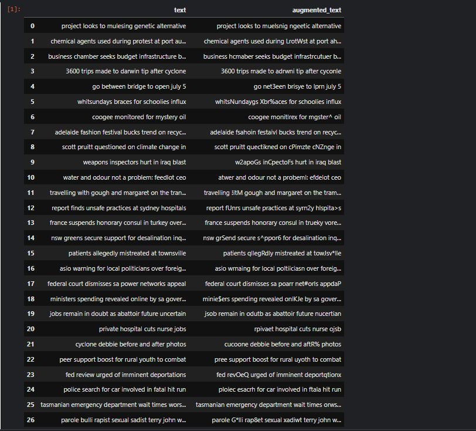
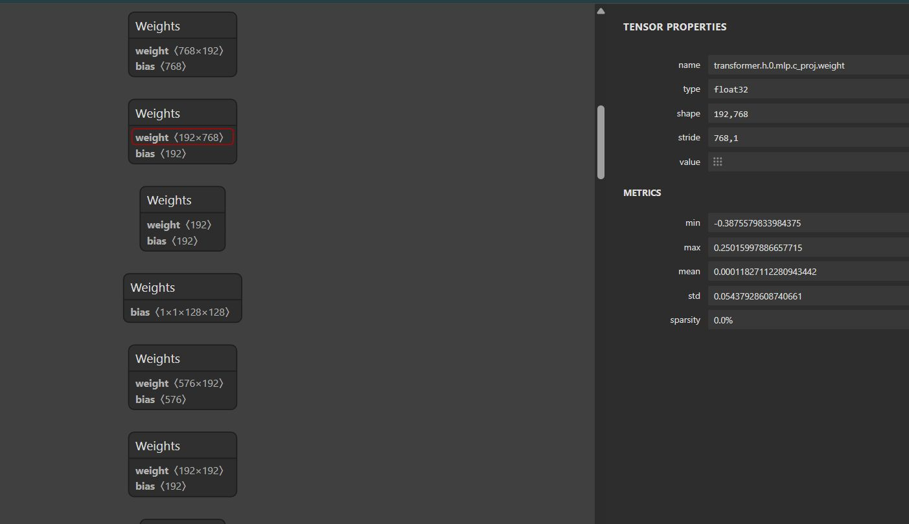
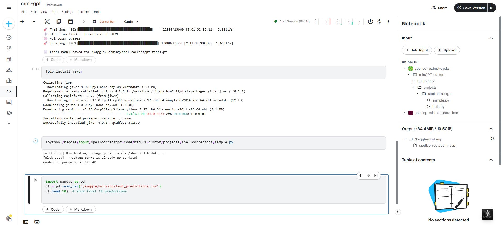
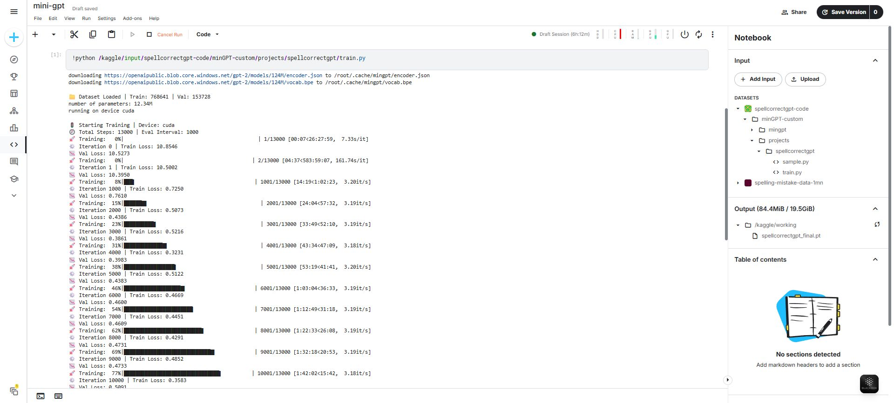

# 🔤 SpellCorrect-GPT: A Tiny GPT for Spelling Error Correction

A decoder-only Transformer model trained from scratch on 1M+ noisy-to-clean sentence pairs to learn **character-level spelling correction** using attention.

Built using a custom version of [minGPT](https://github.com/karpathy/minGPT) and trained on a Kaggle dataset of real spelling mistakes.

---

## 📂 Project Structure

```bash
minGPT-custom/
├── mingpt/                # All core modules (model, attention, etc.)
│   ├── model.py           # GPT model
│   ├── trainer.py         # Training loop abstraction
│   ├── utils.py           # Seed setting, sampling, etc.
│   └── bpe.py             # Custom BPE tokenizer
|-- projects/spellcorrectgpt/
|     |__ train.py         # ⬅️ Run this to train the model
|     |__sample.py         # ⬅️ Run this to test spell correction
├──spellcorrectgpt_final.pt      # pameters (weights of different layers) is stored in it
└── README.md              # This file
```

---

## 🚀 Core Idea

Train a lightweight GPT to correct spelling mistakes using only character-level BPE tokens — no need for massive language understanding. Focus is on:

- Learning patterns of common human typos  
- Fixing messy sentences using attention mechanisms  
- Running with small compute on local/Kaggle  

---

## 📊 Dataset

**Name:** `spelling-mistake-data-1mn`  
**Source:** [Kaggle Dataset](https://www.kaggle.com/datasets/samarthagarwal23/spelling-mistake-data-1mn)  
**Size:** 1M+ sentence pairs (Noisy input → Corrected output)



---

## 🧠 Model Details

- Decoder-only GPT (Karpathy-style)
- Trained from scratch
- Tokenized using custom BPE tokenizer
- Sequence length: 128
- Positional embeddings: learned
- Model size: ~12.34M parameters


---

## 🛠️ How to Run

### ▶️ Train the model

**Run**:
```bash
python train.py
```

**Note**: Edit paths in `config.py` or `train.py` if you're using Kaggle or Colab.

- On Kaggle, upload files and set `input.txt`, and model paths accordingly.
- On local, ensure dataset is placed correctly and adjust `os.path.join()` logic in `train.py`.

---

### 🔍 Test / Inference

**Run**:
```bash
python sample.py
```

It loads the `spellcorrectgpt_final.pt` weights and tokenizes input for correction.


---

## 📦 Outputs

- `spellcorrectgpt_final.pt` — Trained PyTorch checkpoint (~12M params)


---

## 📚 Credits

- Architecture: Adapted from [Karpathy’s minGPT](https://github.com/karpathy/minGPT)
- Dataset: Kaggle spelling correction set
- Tokenization: Custom BPE tokenizer
- Training/Testing: Custom `train.py` and `sample.py` scripts

---

## 🔗 Related Repos

- [minGPT](https://github.com/karpathy/minGPT)
- [NanoGPT](https://github.com/karpathy/nanoGPT) — For scaled-up training later

---

## 🧪 Future Ideas

- Add multi-language support  
- Train on noisy web data (social media text)
- Integrate with text editors or chat UIs

---

> Made with 🔥 and attention heads.
